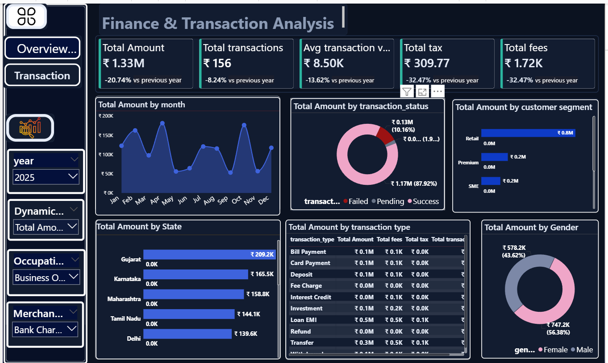
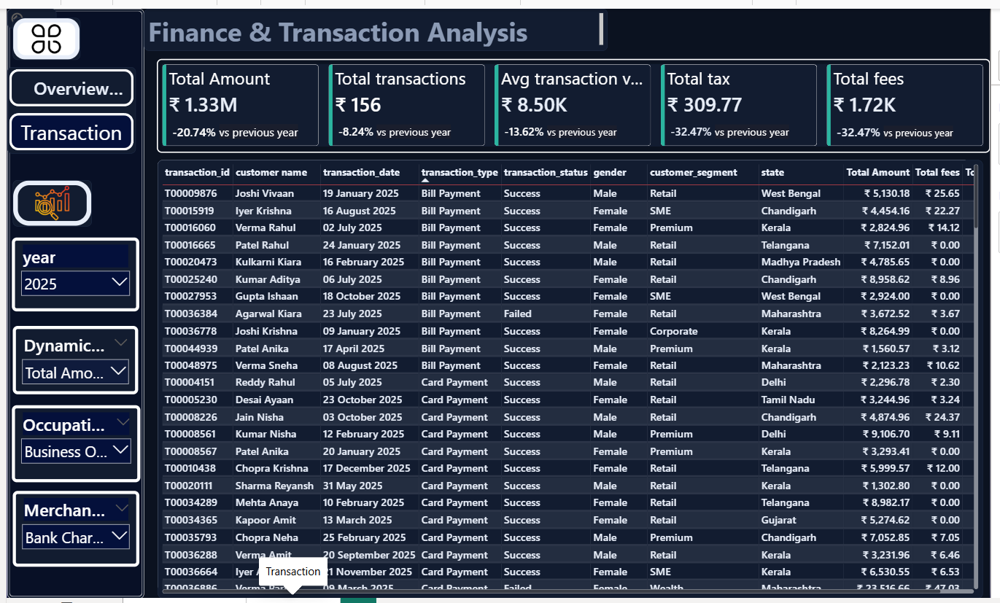

# Finance-Transaction-Analysis

## 📊 Project Overview

### Transaction Details

**Finance & Transaction Analysis** is an interactive Power BI dashboard designed to analyze financial transaction performance and identify business trends across transaction value, transaction volume, customer segments, transaction types, geographic regions, transaction status, and customer demographics.

The dashboard provides both an executive-level overview and transaction-level details to support data-driven financial analysis.

---

## 🎯 Business Objective

The objective of this project is to transform financial transaction data into an interactive business intelligence dashboard that helps users:

- Monitor overall transaction performance
- Track year-over-year changes
- Analyze monthly transaction trends
- Compare customer segments
- Identify high-performing states
- Understand transaction-type contribution
- Monitor successful, failed, and pending transactions
- Analyze gender-wise transaction value
- Review transaction-level details

---

## 📌 Key KPIs

The dashboard includes the following key performance indicators:

- **Total Transaction Amount:** ₹1.33M
- **Total Transactions:** 156
- **Average Transaction Value:** ₹8.50K
- **Total Tax:** ₹309.77
- **Total Fees:** ₹1.72K

### Year-over-Year Performance

- Transaction Amount: **-20.74%**
- Total Transactions: **-8.24%**
- Average Transaction Value: **-13.62%**
- Total Tax: **-32.47%**
- Total Fees: **-32.47%**

---

## 🔍 Key Business Insights

### 1. Transaction Amount Performance

The dashboard shows a **20.74% year-over-year decline in total transaction amount**, while transaction volume declined by **8.24%**.

The average transaction value also declined by **13.62%**, indicating that both transaction activity and transaction value changed compared with the previous year.

### 2. Transaction Status

Successful transactions represent approximately **87.92% of total transaction amount**, while failed transactions account for approximately **10.16%**.

This provides visibility into transaction-status performance and areas requiring further monitoring.

### 3. Customer Segment Analysis

**Retail** is the largest visible customer segment by transaction amount, contributing approximately **₹0.8M**.

Premium and SME segments each contribute approximately **₹0.2M**.

### 4. State-wise Performance

The highest visible transaction amounts by state are:

| State | Transaction Amount |
|---|---:|
| Gujarat | ₹209.2K |
| Karnataka | ₹165.5K |
| Maharashtra | ₹158.8K |
| Tamil Nadu | ₹144.1K |
| Delhi | ₹139.6K |

Gujarat has the highest visible transaction amount among the states shown.

### 5. Gender Analysis

Female customers account for approximately **₹747.2K (56.38%)** of total transaction amount, while male customers account for approximately **₹578.2K (43.62%)**.

### 6. Transaction Type Analysis

The transaction-type analysis shows **Loan EMI** as the largest visible transaction type by transaction amount, followed by **Transfer**.

### 7. Monthly Trend

Monthly transaction amounts vary considerably throughout the year, with higher visible transaction amounts around **April and October** and lower levels around **May, September, and November**.

---

## 📈 Dashboard Pages

### Overview / Executive Analysis

The overview page provides:

- KPI cards
- Monthly transaction trends
- Transaction-status analysis
- Customer-segment analysis
- State-wise analysis
- Transaction-type analysis
- Gender analysis
- Interactive filters

### Transaction Detail

The transaction detail page provides transaction-level information including:

- Transaction ID
- Customer Name
- Transaction Date
- Transaction Type
- Transaction Status
- Gender
- Customer Segment
- State
- Total Amount
- Fees
- Tax
- Other transaction attributes

---

## 🛠️ Tools & Technologies

- **Power BI**
- **DAX**
- **Power Query**
- **Data Visualization**
- **Business Intelligence**
- **Financial Data Analysis**

---

## 📊 Skills Demonstrated

- Interactive Dashboard Development
- KPI Development
- Financial Transaction Analysis
- Year-over-Year Analysis
- Trend Analysis
- Customer Segmentation
- Geographic Analysis
- Transaction Status Analysis
- Transaction Type Analysis
- Data Visualization
- Business Insights
- Interactive Filtering
- Detailed Transaction Reporting

---

## 💡 Business Value

The dashboard converts transaction-level data into an interactive analytical view that enables users to monitor financial performance, compare customer and regional contributions, identify transaction-status patterns, and investigate changes in transaction activity.

---

---
